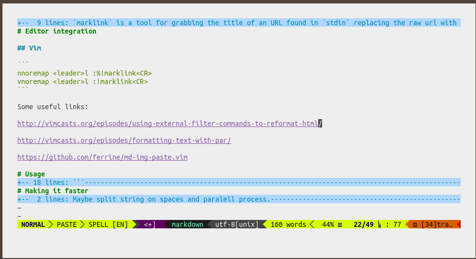

# marklink

`marklink` replaces URLs found in text with a markup hyperlink with the contents
of the `<title>` tag in the HTML of the URL. It works like a typical [Unix
filter](https://en.wikipedia.org/wiki/Filter_(software)):

```sh
echo "I like https://github.com?something=what" | marklink --format md --remove-query

I like [GitHub: Where the world builds software · GitHub](https://github.com)
```

Its goal is to increase the ergonomics of writing, thus leading you to write more. You get to experience the joy of having robots helping you while writing.

Inspired by [Titler by Brett Terpstra](http://brettterpstra.com/2015/02/18/titler-system-service/) for Mac OS and [org-cliplink](https://github.com/rexim/org-cliplink) for Emacs.

The ultimate goal of this project is to be cross platform and support many formats, workflows and editors.



# Installation

With `pip`:

```sh
pip install --user git+https://github.com/staticaland/marklink.git#egg=marklink
```

With `pipx`:

```sh
pipx install 'git+https://github.com/staticaland/marklink.git#egg=marklink'
```

# Editor integration

## Vim

```
nnoremap <leader>l :%!marklink<CR>
vnoremap <leader>l :!marklink<CR>
```

This is reminiscent of the [Vim Kōan *Master Wq and the Markdown
acolyte*](https://blog.sanctum.geek.nz/vim-koans/).

## Emacs

I use `reformatter.el` (see [my reformatter.el config here](https://github.com/staticaland/doom-emacs-config/blob/master/modules/editor/reformatter/config.el)).

You can also use some variant of `shell-command-on-region`:

```elisp
(defun marklink-org ()
  (interactive *)
  (save-excursion
    (shell-command-on-region (mark) (point) "marklink --format org" (buffer-name) t)))
```

You may have to set the following if you like an exotic `$SHELL`:

```elisp
(setq explicit-shell-file-name "/bin/bash")
(setq shell-file-name explicit-shell-file-name)
```

## Atom, Sublime Text, VS Code et al.

Pull requests most welcome.

You may want to consider [Paste URL at the Visual Studio
Marketplace](https://marketplace.visualstudio.com/items?itemName=kukushi.pasteurl).

# Usage

```sh
usage: marklink [-h] [-f {md,org,html}] [-q] [files]

Args that start with '--' (eg. -f) can also be set in a config file
(~/.marklink). Config file syntax allows: key=value, flag=true, stuff=[a,b,c]
(for details, see syntax at https://goo.gl/R74nmi). If an arg is specified in
more than one place, then commandline values override config file values which
override defaults.

positional arguments:
  files

optional arguments:
  -h, --help            show this help message and exit
  -f {md,org,html}, --format {md,org,html}
                        which format
  -q, --remove-query    remove query parameters
```

# Other alternatives

Use a bookmarklet ([source](https://old.reddit.com/r/emacs/comments/682wsu/bookmarklet_to_copy_link_to_clipboard_formatted/)):

```js
javascript:(
    function(){
        prompt(
            '',
            '[['
                +location.href
                +']['
                +document.title.replace(/ [-,|].*$/,'')
                +']]'
        )
    }
)()
```

Some useful links:

[Using external filter commands to reformat HTML](http://vimcasts.org/episodes/using-external-filter-commands-to-reformat-html/)

[Formatting text with par](http://vimcasts.org/episodes/formatting-text-with-par/)

[GitHub - ferrine/md-img-paste.vim: paste image to markdown](https://github.com/ferrine/md-img-paste.vim)

[Vim Tip: Paste Markdown Link with Automatic Title Fetching | Ben Congdon](https://benjamincongdon.me/blog/2020/06/27/Vim-Tip-Paste-Markdown-Link-with-Automatic-Title-Fetching/)

[GitHub - alphapapa/org-web-tools: View, capture, and archive Web pages in Org-mode](https://github.com/alphapapa/org-web-tools)

# Plans

Add to Python Package Index.

Make it faster. Do concurrent HTTP requests somehow.

Ignore files such as images.

Rewrite to golang to avoid dependencies for end users.

Set another user agent.

Change the name.

org-mode gif.
