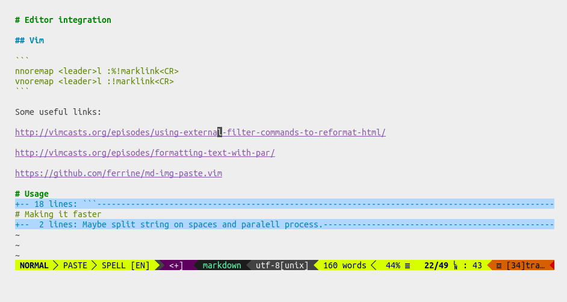

# marklink

`marklink` replaces URLs found in text with a hyperlink containing the HTML `<title>` tag.

Its goal is to increase the ergonomics of writing, thus leading you to write more. Effortlessly. There's also the joy of having robots helping you.

Inspired by [Titler by Brett Terpstra](http://brettterpstra.com/2015/02/18/titler-system-service/) for Mac OS and [org-cliplink](https://github.com/rexim/org-cliplink) for Emacs.

The ultimate goal of this project is to be cross platform and support many formats, workflows and editors.



# Installation

With pip:

```
pip install --user git+https://github.com/staticaland/marklink.git#egg=marklink
```

With pipsi:

```
pipsi install git+https://github.com/staticaland/marklink.git#egg=marklink
```

# Editor integration

## Vim

```
nnoremap <leader>l :%!marklink<CR>
vnoremap <leader>l :!marklink<CR>
```

Some useful links:

[Using external filter commands to reformat HTML](http://vimcasts.org/episodes/using-external-filter-commands-to-reformat-html/)

[Formatting text with par](http://vimcasts.org/episodes/formatting-text-with-par/)

[GitHub - ferrine/md-img-paste.vim: paste image to markdown](https://github.com/ferrine/md-img-paste.vim)

## Emacs

Use `shell-command-on-region`. You may have to set the following if you like an exotic `$SHELL`:

```
(setq explicit-shell-file-name "/bin/bash")
(setq shell-file-name explicit-shell-file-name)
```

Useful stuff:

[alphapapa/org-protocol-capture-html: Capture HTML from the browser selection into Emacs as org-mode content](https://github.com/alphapapa/org-protocol-capture-html)

[Reddit - bookmarklet](https://www.reddit.com/r/emacs/comments/682wsu/bookmarklet_to_copy_link_to_clipboard_formatted/)

## Atom, Sublime Text, VS Code et al.

Pull requests most welcome.

# Usage

```
usage: marklink [-h] [-f {md,org,html}] [-q] [files]

Args that start with '--' (eg. -f) can also be set in a config file
(~/.marklink). Config file syntax allows: key=value, flag=true, stuff=[a,b,c]
(for details, see syntax at https://goo.gl/R74nmi). If an arg is specified in
more than one place, then commandline values override config file values which
override defaults.

positional arguments:
  files

optional arguments:
  -h, --help            show this help message and exit
  -f {md,org,html}, --format {md,org,html}
                        which format
  -q, --remove-query    remove query parameters
```

# Plans

Add to Python Package Index.

Make it faster. Do concurrent HTTP requests somehow.

Ignore files such as images.

Rewrite to golang to avoid dependencies for end users.

Set another user agent.

Change the name.